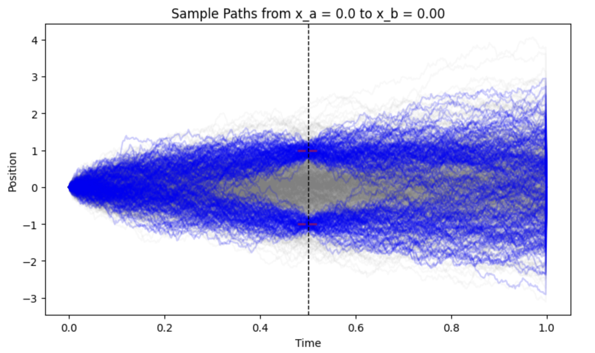
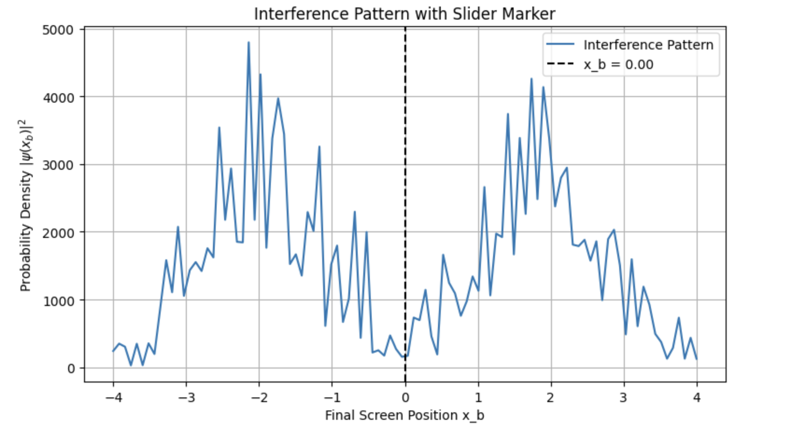
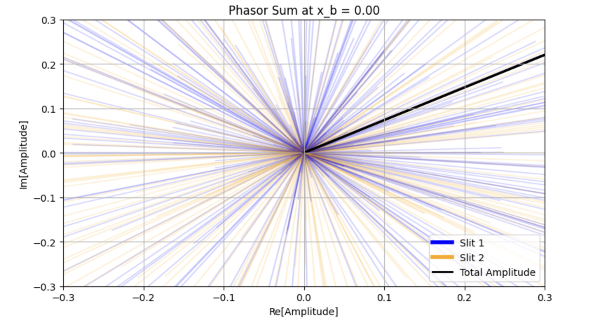
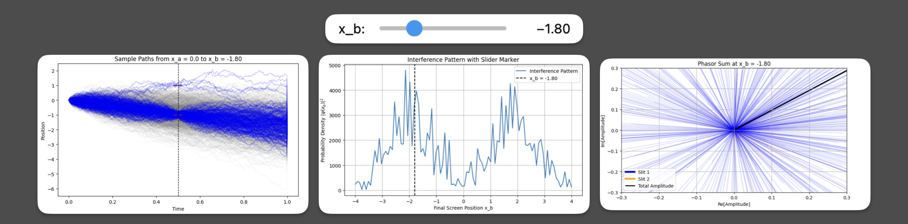
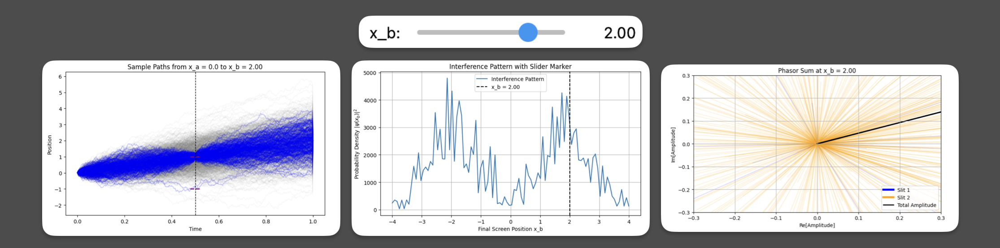

#  Feynman Path Integral Simulator

This is a visual and interactive simulation of Feynman's path integral formulation using Monte Carlo methods. This notebook samples thousands of random paths between two points to model quantum interference. It features animated plots showing sample paths, interference patterns, and complex phasor sums.

## Preview

Below are the three main interactive visualizations included in the notebook:

### 1. Sample Paths Through Slits

Shows randomly sampled trajectories from the source \(x_a\) to the screen position \(x_b\). Paths that pass through one of the slits are highlighted.

---

### 2. Interference Pattern

Plots the probability density across all possible final positions. The black, dashed, vertical line marks the current screen location \(x_b\) selected by the slider.

---

### 3. Phasor Diagram (Complex Amplitude)

Each path contributes a complex-valued amplitude, shown as a vector. The black arrow represents the total amplitude, the sum of all phasors. This visualizes quantum interference directly in the complex plane.

The notebook has an interactive slider that allows the user to change the final screen position. Here are the graphs at -1.80 and 2.00 on the slider:

## Project Overview

This notebook simulates quantum particle behavior in a double-slit experiment using Feynman's path integral formulation. The simulation:
- Randomly generates many possible paths between two fixed points
- Calculates each path's quantum phase using the classical action
- Summarizes these complex amplitudes as vectors (phasors)
- Visualizes the total amplitude and resulting interference pattern

Use the **slider** to change the final screen position \( x_b \) and watch the interference evolve in real time.

## Core Concepts

- **Path Integrals**: Instead of following one path, particles take *all possible paths*. Each path contributes a complex amplitude
- **Quantum Interference**: Amplitudes from different paths interfere… they can reinforce or cancel each other
- **Phasor Diagram**: A visual sum of all contributing amplitudes as complex vectors
- **Monte Carlo Sampling**: Random paths are generated using a stochastic process to estimate the full path integral numerically

## Features

- Interactive slider to explore \( x_b \) values across the screen
- Animated, layered path visualizations with slit highlights
- Phasor diagram showing constructive and destructive interference
- Colorblind-friendly design and dynamic axis scaling

## Requirements

This notebook runs in any standard Jupyter environment with the following packages:

- `numpy`
- `matplotlib`
- `ipywidgets`

